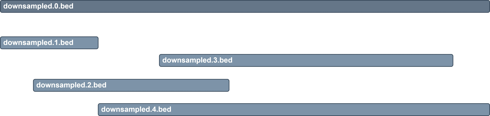
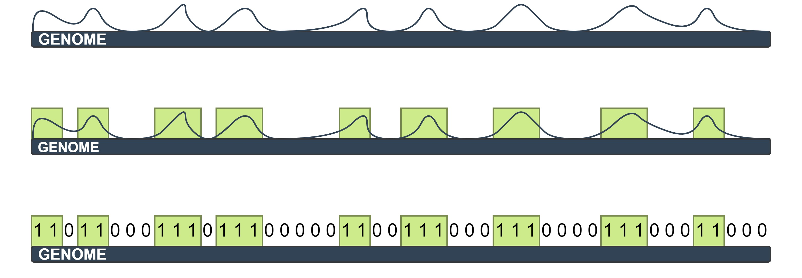

Overview
========

Why chromTools?
---------------

Using multiple different epigenetic data types as input, chromatin state annotation algorithms segment and annotate the genome based on the combination of epigenetic marks found at each genomic position, assigning a chromatin state label to each segment. However, there are currently no generally agreed-upon statistics to determine the quality of a particular annotation.

While tools have been developed to evaluate the characteristics of an annotation, the accuracy of the derived chromatin state labels is also reliant upon a robust input dataset that represents a complete set of marks across the genome. **chromTools complete** aims to provide the user with the ability to assesses the extent to which their epigenetic dataset captures the complete set of marks, using a subsampling approach to estimate the number of reads required to approach the complete sampling of the mark

What does chromTools do?
------------------------

chromTools complete
~~~~~~~~~~~~~~~~~~~

**1. Concatenates**
The tool takes as input aligned BED files (not peak called files) from ChIP-seq, ATAC-seq or WGBS experiments. Control data can also be optionally included. It first concatenates the input files into a file containing all lines of the dataset :code:`downsampled.0.bed`. If control files are specified these are concatenated to create :code:`downsampled.ctrl.bed`.

**2. Downsamples**
After concatenating the samples, a random downsampling algorithm is applied to the complete dataset to retain an incremental (user-specified) subset of the reads e.g. of a complete 1000 read dataset, the user may specify an increment of 200 and the program will generate 4 files with 200, 400, 600 and 800 reads respectively. Reads from the same template (e.g. read-pairs, secondary and supplementary reads) are all either kept or discarded as a unit, with the aim of retaining reads from :math:`increment * template`. Each read is given a probability P of being retained so that runs performed with the exact same input in the same order and with the same value for :code:`RANDOM_SEED` will produce the same results. Due to the nature of the algorithm, the results will be approximate. Particularly, the accuracy of the downsampling algorithm will be much lower if the increment represents a very small proportion of the total. This is assumed not to be an issue in most use cases as the program is designed to give an overview of completeness and data-points for very small increments are superfluous to this aim.

**3. Binarises**
Subsequently, the tool implements a version of the ChromHMM binarisation step. Briefly, the genome is binned into 200bp bins and the mark deemed as absent (0) or present (1) dependent on the signal compared to a Poisson background distribution. If no control data is specified, the parameter to the Poisson distribution is the global average number of reads per bin. If control data is specified the global average number of reads is multiplied by the local enrichment for control reads as determined by the specified parameters.

**4. Calculates metrics**
Finally, the proportion of marks compared to total bins is calculated per sub-sampled file and the Michaelis-Menten kinetics of the resulting data is also calculated. The output includes the plots for the latter two calculations, a text file of the proportion of marks and a text file indicating the :math:`Vm`, or saturation point of the dataset.