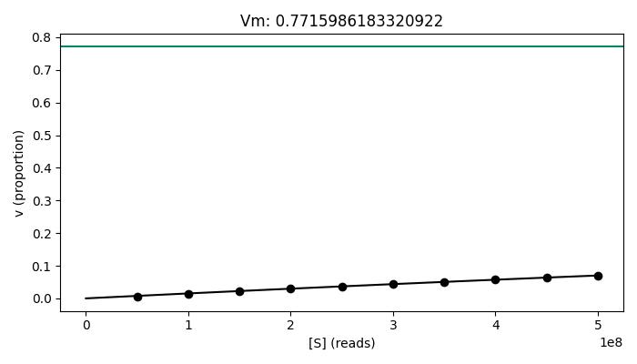

General Usage
=============

Input
-----

For all data types, **chromTools complete** takes as input a set of aligned `browser extensible data (BED) <https://genome.ucsc.edu/FAQ/FAQformat.html#format1>`_ files. The BED format is a concise and flexible way to represent genomic features and annotations. The format supports up to 12 columns, but for **chromTools complete** only the first **4** are required.

Required columns
~~~~~~~~~~~~~~~~

1. **chrom** - The name of the chromosome.
   This column is required.
2. **start** - The zero-based starting position of the feature in the chromosome.
   The first base in a chromosome is numbered 0.
   The start position in each BED feature is therefore interpreted to be 1 greater than the start position listed in the feature. For example, start=9, end=20 is interpreted to span bases 10 through 20,inclusive.
   This column is required.
3. **end** - The one-based ending position of the feature in the chromosome.
   The end position in each BED feature is one-based. See example above.
   This column is required.
4. **name** - Defines the name of the BED feature, in this case the readname.
   This column is required.

Example pipeline and input file
~~~~~~~~~~~~~~~~~~~~~~~~~~~~~~~

A typical pipeline prior to using **chromTools complete** might be:

:code:`raw data > qc > alignment > bamToBed`

Resulting in an aligned BED input file, e.g.:

.. literalinclude:: ../../test/test_s1.bed
   :lines: 1-12

.. note::

   The command will fail if you try to use peak-called BED files!

Output
------

The outputs from the various steps of **chromTools complete** are created in the following directory structure, within the :code:`--outdir` parameter.

.. code-block:: none

   <outdir>
   ├── 1_subsample/
   │   ├── downsampled.0.bed
   │   └── ...
   ├── 2_binarise/
   │   ├── 0_chr1_binary.txt
   │   └── ...
   ├── completeness.txt
   ├── completeplot.jpg
   ├── mm.txt
   └── mmplot.jpg
   
Downsampled files are generated in :code:`<outdir>/1_subsample/` and binarised files in :code:`<outdir>/2_binarise/`.

Information on how to interpret the output plots, :code:`completeplot.jpg` and :code:`mmplot.jpg` can be found in :ref:`interpretation <interpretation>`.

Basic usage
-----------

.. code-block::

   $ chromTools complete \
      --files/-f <reads.bed> \
      --control/-c <controlreads.bed> \
      --increment/-i <int> \
      --outdir/-o <outdir> \
      --genome/-g <genome>  \
      --gsize <int> \
      --seed/-s <int>  \
      --paired \
      --force-overwrite

Required parameters
~~~~~~~~~~~~~~~~~~~

:code:`--files/-f <reads.bed>`: BED files of the dataset. Must be aligned files. Should include full path to file.

Optional parameters
~~~~~~~~~~~~~~~~~~~

:code:`--control/-c <controlreads.bed>`: Optional flag containing BED-formatted control files. Must include full path. If unspecified, flag is set to FALSE.

:code:`--outdir/-o <outdir>`: Path to output directory where structure :code:`<outdir>/1_subsample/ <outdir>/2_binarise/` and output files will be created. Directory will be created if it does not exist. Default: current working directory.

:code:`--increment/-i <int>`: Amount of reads/read pairs by which to incrementally subsample. e.g. If left to default the whole dataset will be subsampled to 50000000, 100000000, 150000000 etc. Default: 50000000.

:code:`--genome/-g`: A two column tab delimited file with the first column being the chromosome and the second being the chromosome length. Genome assemblies hg18, hg19, hg38, mm9, mm10, rn5, rn6, danRer7, danRer10, dm3, dm6, ce6, and ce10 can be accessed by their genome assembly name (e.g. hg19). For other assemblies these can be obtained with the fetchChromSizes script available from the UCSC browser http://hgdownload.cse.ucsc.edu/admin/exe/ specifying the desired assembly and redirecting the output to a text file. Default: hg38.

:code:`--gsize <int>`: Size of genome using. Required if specifying own genome chromosome length file. Default: FALSE

:code:`--seed <int>`: The seed used for initiating randomization operations. Default: randomly generated.

:code:`--paired`: If specified, data will be treated as paired end. Default: FALSE.

:code:`--force-overwrite`: If specified, files and directories in outdir will be overwritten. Default: FALSE.

Example Usage
-------------

In the repository are the test files :code:`test_s1.bed` and :code:`test_s2.bed` which we will use as input in this toy example.

:code:`$ head(test_s1.bed)`

.. literalinclude:: ../../test/test_s1.bed
   :lines: 1-10

:code:`$ head(test_s2.bed)`

.. literalinclude:: ../../test/test_s2.bed
   :lines: 1-10

Once **chromTools** has been installed, the following command can be run. As this is paired data we are specifying the :code:`--paired` flag. Make sure you are in the directory where the test files are located.

.. code-block:: console

   $ chromTools complete -f test_s1.bed test_s2.bed --outdir tmp/ --increment 25 --genome hg37 --paired

This will create the directory :code:`tmp/` and subdirectories within this and provide an output for interpretation.

.. _interpretation:

Interpretation
--------------

In the output two plots are generated, ``mmplot.jpg`` and ``completeplot.jpg``. 

``completeplot`` shows the proportion of marks found, plotted against the read number.

In the plot below, you can see an example of a complete dataset. Here, the proportion of marks has reached a plateau where even with the addition of more reads, there is not an increase in information. Therefore, this indicates that the dataset represents the totality of possible marks. 

``mmplot`` gives an indication of the saturation point of the dataset, i.e. the proportion of marks present. The more complete a dataset is, the more accurate this will be. It also gives 

.. image:: _static/img/goodmmplt.jpg
  :width: 50%
  :alt: Bad MM plot

